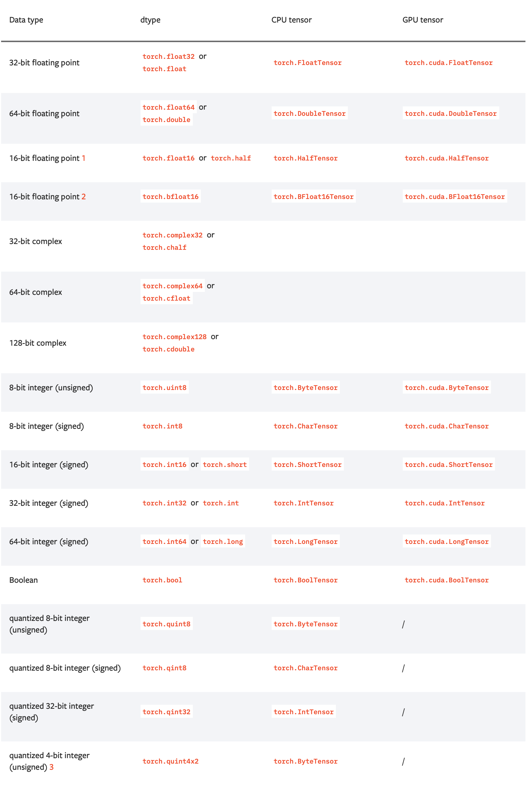
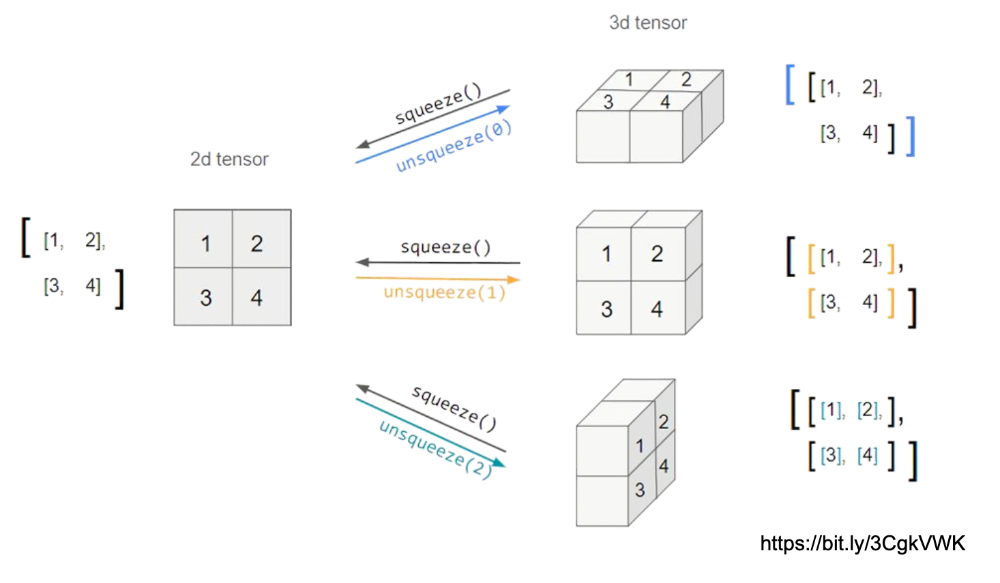
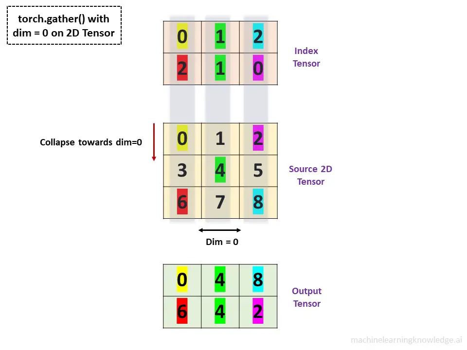

# 2주차 개인 학습 정리

네이버 부스트캠프 AI Tech 2023. 11. 13. (월) - 2023. 11. 17. (금) 주간 학습 회고입니다.

## 종합 평가

| 항목           | 평가  | 비고                                                                                                                        |
| -------------- | ----- | --------------------------------------------------------------------------------------------------------------------------- |
| 🧑‍🏫 강의 이해도 | ★★★★☆ | PyTorch 텐서 연산자에 대한 기초 지식과 커스텀 모듈 및 데이터에 대한 이론 이해완료. `torch.gather` 등 일부 개념은 복습 필요. |
| 📝 과제/퀴즈   | ★★★★☆ | 강의 내용이 기억나지 않아 오답 발생한 경우 조금 있었음.                                                                     |
| 🎯 목표 도달   | ★★★★☆ | 강의/과제에 대한 개인 목표치 달성 완료. 과제 내 선택구현사항을 완료하지 못한 부분 존재.                                     |

## 학습 내용 정리

### Tensor Data Types



> PyTorch Docs

### Tensor Handling



### `torch.gather`

```python
torch.gather(input, dim=0, index=torch.tensor([[0, 1, 2], [2, 1, 0]]))
```



### `torch.nn.Module`

- `torch.nn.Parameter`: 학습 가능한 경우, `required_grad=True`
- `backward()`: Loss (model output과 실제 값 간의 차이)에 대한 미분 후, **parameter update까지 진행**

## 추가 참고자료

- [PyTorch 공식 문서](https://pytorch.org/docs/stable/generated/torch.gather.html)
- [블로그 - 2D 단위 잘 정리](https://data-newbie.tistory.com/709)
- [그림으로 정리](https://machinelearningknowledge.ai/how-to-use-torch-gather-function-in-pytorch-with-examples/)
- [블로그 - 많은 예시](https://androidkt.com/how-to-use-pytorch-gather-function-for-indexing/)

## 기타사항

- **스페셜 피어 세션** (11/17): 타 팀원들의 피어 세션 진행 방식에 대해 다시 한번 듣게 되는 유익한 시간이었음. 한 조 내부에서, 그 동안 나온 질문 내용을 구글 시트에 정리한다는 이야기를 듣고 새로운 학습 정리 방식에 대해 기존 팀원들과의 피어 세션에서 토의함.
